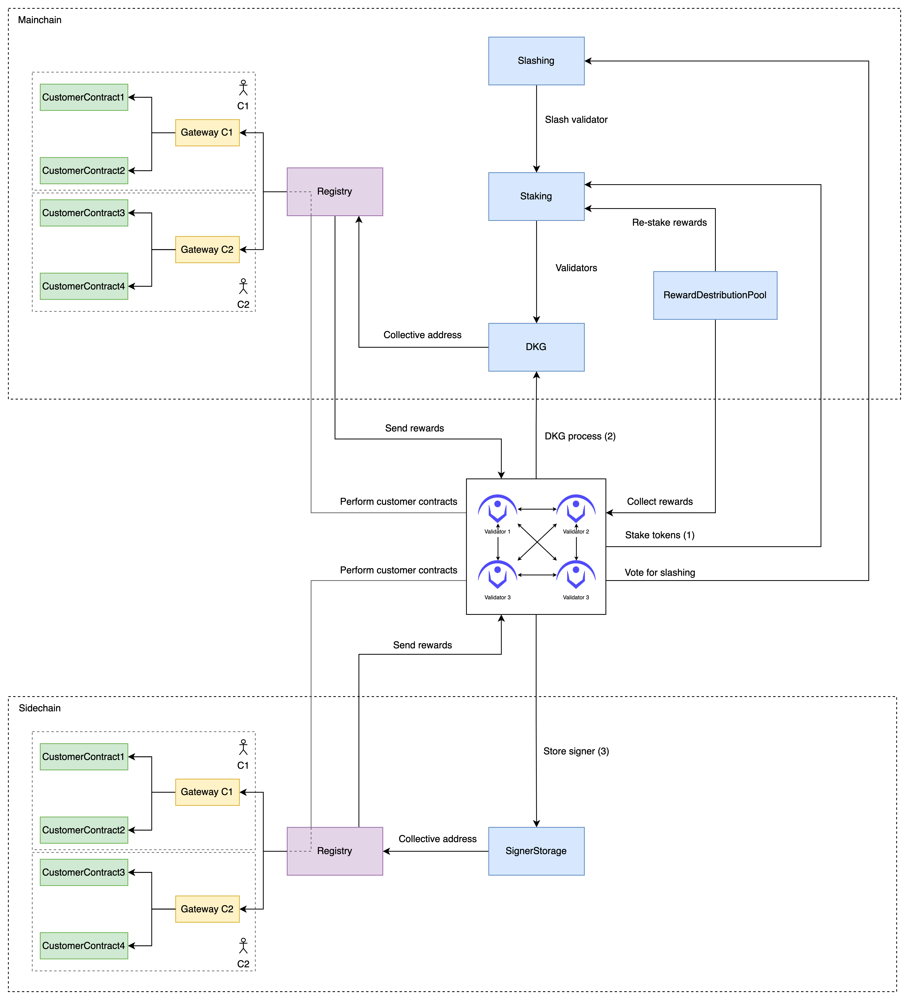

# Nerif Network Contracts

This repository contains Solidity contracts needed to bootstrap and run Nerif Network.

The setup consists of twy types of contracts:
- [**system**](./contracts/system) contracts are needed to secure the network, such as staking contract, slashing mechanism, etc.
- [**operational**](./contracts/operational) contracts are needed to make the network work: registry, signer storage, and gateway.



## Set up environment

The first step is to initialize environment by running the following command:

```bash
$ make init
```

The command installs node packages, compiles contracts, and creates `.env` config file with default mocked values.
Those values must be replaced with the real ones.

### Run Tests

The following command runs tests:

```bash
$ npm run test
```

## Deployment

The current hardhat configuration supports 3 ENV-compatible networks: Goerli, Mumbai, BSC Testnet.
More networks could be added if needed.

In this example, `mumbai` is going to be a mainchain.
That means this network is going to be used for system contracts deployment as well as operational ones.
Other sidechains include operational contracts only. 

In order to deploy to another chain, `--network` parameter should be changed.

The following command deploys all contracts in the proper order on all supported chains:

```bash
$ make deploy
```

*Node: take a look at the Makefile*

After system contracts are deployed on mainchain, the script asks to start DKG process in order to set up a collective signer address.
This address is going to be used within another contracts across all supported chains.

During the network bootstrap, each node requests a DKG contract address in order to start the process.
Each network participant (Nerif Node) **must stake** a specific number of tokens in order to join the network, and it should be done before starting the node.
If the current validator have not staked, the node will ask for approval to stake tokens.

### Verify Contracts

To verify contracts, you need to specify network, contract address and constructor parameters (if present).

```
$ npx hardhat verify --network <network-name> <CONTRACT_ADDRESS> <CONSTRUCTOR_PARAMETERS>
```

Or you can set `VERIFY` variable to `true` while deploying contracts to automatically verify them afterwards.

```
$ VERIFY=true make deploy
```

## TODO

1. Send rewards to the rewards distribution pool
2. Fund the generated collective address OR ask validators to fund it